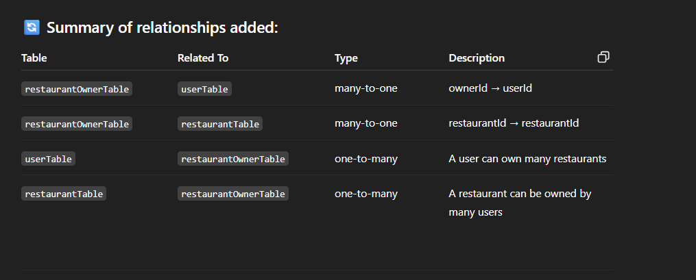

### Package.json initialization

```
pnpm init
```

```
pnpn add dotenv drizzle-orm  pg
pnpm add -D tsx typescript @types/pg @types/node
```

### Ts config and drizzle config file initialization

```
pnpm tsc --init 
```

### Seeding the table

```
pnpm tsx src/drizzle/seed.ts
```


